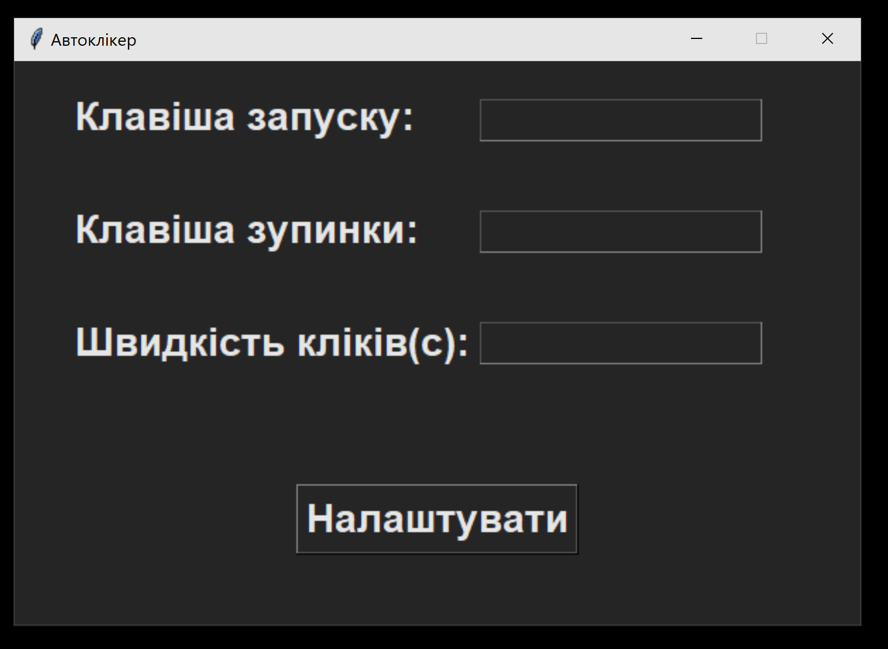

# AutoClicker

Простий Автоклікер на пайтні та із графічним інтерфефсом, принцип роботи:
1. ми задаємо кнопку при якій будемо включати кліккер
2. ми задаємо кнопку при якій будемо вимикати кліккер
3. ми задаємо швидкість кліків
4. нажимаємо налаштувати та користуємось клікером

# Тест
ставимо швидкість кліків 0.01 та перевіримо скільки ми зробимо кліків за 5 секунд на сайті https://clickspeedtest.com/

Результат 632 кліка за 5 секунд